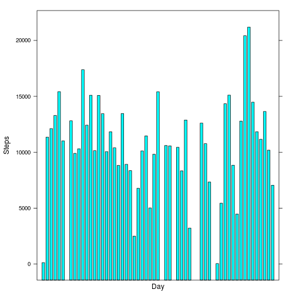
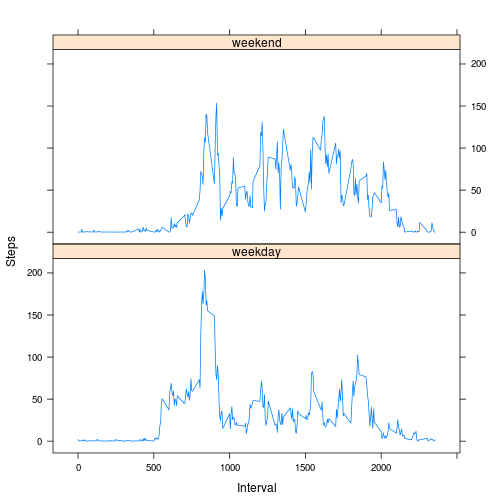

# Reproducible Research: Peer Assessment 1

Personal movement data can now be collected via a number of different mechanisms, including purpose built devices as well as more general purpose devices such as phones that are likely to be with a person for a large portion of a day.

This assignment examines some data collected from an anonymous individual taken at 5 minute intervals throughout the day.  This data includes raw data gathered from October and November 2012 and includes the step data during that time.

## Loading and preprocessing the data

The data for this study consists of three variables:

| Variable      | Type         | Description
|:------------- |:------------ |:---------------------------------------
| steps         | numeric      | number of steps recorded during interval
| date          | Date         | date the activity was recorded
| interval      | numeric      | identifier of the 5 minute interval being recorded


The data should be available as part of the download where this
docment was obtained.  It is present as the file 'activity.zip'
in the GitHub repository.  If the file is not available, it can
be obtained from the web.


```r
## Including the URL here in case the source datafile is not present.
dataUrl <- "https://d396qusza40orc.cloudfront.net/repdata%2Fdata%2Factivity.zip"
zipFile <- "activity.zip"
dataFile <- "activity.csv"

if (!file.exists(zipFile)) {
    download.file(dataUrl, destfile = zipFile, method = "curl")
    downloadDate <- date()
}

# Clean out any old data.
if (exists("dataset")) {
    rm(dataset)
}

# Read in the data.
dataset <- read.table(unz(zipFile, dataFile), sep = ",", stringsAsFactors = F, 
    na.strings = "NA", header = T, colClasses = c(NA, "Date", NA))
```


## What is mean total number of steps taken per day?

First we can get a quick look at the number of steps taken each day over the reporting period.  We can total the steps for each day:


```r
# Clean out any old data.
if (exists("stepsByDay")) {
    rm(stepsByDay)
}

# stepsByDay <- tapply(dataset$steps,dataset$date,sum)
stepsByDay <- aggregate(dataset$steps, list(dataset$date), sum)
names(stepsByDay) <- c("Date", "Steps")
```


Then we can see how many days each level of stepping was acheived:


```r
hist(stepsByDay$Steps, breaks = 25, xlab = "Total Steps for a Day", main = "Missing Data Ignored")
```

 


Here is a quick look at how many steps were taken each day that data is available for:


```r
library(lattice)
barchart(as.numeric(Steps) ~ as.factor(Date), data = stepsByDay, horizontal = F, 
    ylab = "Steps", xlab = "Day", scales = list(x = list(draw = F)))
```

 


And numerically, the characteristics of stepping for each day are:


```r
dailyMean <- mean(stepsByDay$Steps, na.rm = T)
dailyMedian <- median(stepsByDay$Steps, na.rm = T)
```


With the average number of steps taken per day over the time data is available at: **10766**, and a median value of: **10765**.

## What is the average daily activity pattern?


```r
# Bind the NA removal to our call to calculate the average.
domean <- function(x) mean(x, na.rm = T)

# Clean out any old data.
if (exists("stepsByInterval")) {
    rm(stepsByInterval)
}

# stepsByInterval <- tapply(dataset$steps,dataset$interval,domean)
stepsByInterval <- aggregate(dataset$steps, list(dataset$interval), domean)
names(stepsByInterval) <- c("Interval", "Steps")

# Save off the original interval value type so we can match it back to the
# original data set below.
intervals <- stepsByInterval$Interval

# Now convert the interval to a time value.
stepsByInterval$Interval <- strptime(formatC(stepsByInterval$Interval, width = 4, 
    flag = "0"), "%H%M")

summary(stepsByInterval)
```

```
##     Interval                       Steps       
##  Min.   :2014-05-18 00:00:00   Min.   :  0.00  
##  1st Qu.:2014-05-18 05:58:45   1st Qu.:  2.49  
##  Median :2014-05-18 11:57:30   Median : 34.11  
##  Mean   :2014-05-18 11:57:30   Mean   : 37.38  
##  3rd Qu.:2014-05-18 17:56:15   3rd Qu.: 52.83  
##  Max.   :2014-05-18 23:55:00   Max.   :206.17
```

```r
str(stepsByInterval)
```

```
## 'data.frame':	288 obs. of  2 variables:
##  $ Interval: POSIXlt, format: "2014-05-18 00:00:00" "2014-05-18 00:05:00" ...
##  $ Steps   : num  1.717 0.3396 0.1321 0.1509 0.0755 ...
```


So now we can take a look at the average number of steps by the time of day over the period the data was gathered:


```r
plot(stepsByInterval, type = "l", xlab = "Time of Day", ylab = "Average Steps")
```

 


And we see that sometime in the mid-morning is when the most steps are taken, on average.  If we want to know when that time is, we can simply extract it from the data:


```r
maxSteps <- stepsByInterval[stepsByInterval$Steps == max(stepsByInterval$Steps), 
    ]
maxSteps
```

```
##                Interval Steps
## 104 2014-05-18 08:35:00 206.2
```


So the interval where the maximum of **206.1698** steps, on average, were taken was interval **0835**, or at **08:35 AM**.


## Imputing missing values

Find the total number of NA values in the original data:


```r
total_na <- sum(is.na(dataset$steps))
```


which is a total of **2304** NA values out of the **17568** possible.

We can replace the NA values with the mean of values for that interval each day as a mechanism to avoid simply ignoring the missing data.


```r
# Clean out any old data.
if (exists("newdata")) {
    rm(newdata)
}

# Make a new copy of the data to work with.
newdata <- dataset

# Find the rows where NA values are located.
na_rows <- is.na(dataset$steps)

# Indices of the NA intervals in the average data.
num_intervals <- dim(stepsByInterval)[1]

# Rows of the bins for the NA values.
na_bins <- newdata[na_rows, "interval"] == intervals

# Replace the NA values with the corresponding average.
newdata[na_rows, "steps"] = stepsByInterval[na_bins%%num_intervals, "Steps"]
```


Note that at this point we have a "clean" data set and no longer need
to account for NA values in the data when plotting or calculating
using the data. And we can compare the imputed data with the original
data to see what, if any, differences there are.

Find the number of steps taken within a day:


```r
# Clean out any old data.
if (exists("newStepsByDay")) {
    rm(newStepsByDay)
}

# newStepsByDay <- tapply(dataset$steps,dataset$date,sum)
newStepsByDay <- aggregate(newdata$steps, list(newdata$date), sum)
names(newStepsByDay) <- c("Date", "Steps")
```


Then we can see how many days each level of stepping was acheived:


```r
hist(newStepsByDay$Steps, breaks = 25, xlab = "Total Steps for a Day", main = "Missing Data Estimated")
```

 


We can see from the histogram that the main difference from the data where we ignored the missing data is that many more low value total steps per day were added to the data.  The average number of steps that replaced an NA in the dataset was **1.717**, which is clearly going to bring the aggregate descriptive statistics down in value.  This is inuitive since the missing data is likely to have been for intervals where little activity was typically measured - such as early in the day or late at night.

We can calculate the imputed mean and median to show how they have changed:


```r
dailyMean <- mean(newStepsByDay$Steps)
dailyMedian <- median(newStepsByDay$Steps)
```


Where the new average number of steps taken per day over the time data is: **9419**, with a median value of: **10395**.  As expected, these are clearly lower than the values where missing data was ignored.


## Are there differences in activity patterns between weekdays and weekends?

Now lets add a new factor - weekday v. weekend.


```r
# Initialize all the days to weekdays.
newdata$daytype <- factor(rep("weekday", length(newdata$date)), c("weekday", 
    "weekend"))

# Change the weekends to weekends.  :)
newdata$daytype[grep("^S", weekdays(dataset$date))] = "weekend"
```


And summarize the data by interval:


```r
# Clean out any old data.
if (exists("weekdaySteps")) {
    rm(weekdaySteps)
}

# Average the steps per interval for weekdays.
weekdaySteps <- aggregate(newdata$steps[newdata$daytype == "weekday"], list(newdata$interval[newdata$daytype == 
    "weekday"]), mean)
names(weekdaySteps) <- c("Interval", "Steps")
weekdaySteps$daytype <- factor(rep("weekday", length(weekdaySteps$Interval)), 
    c("weekday", "weekend"))

# Convert the interval to a time value. weekdaySteps$Interval <- strptime(
# formatC(weekdaySteps$Interval,width=4,flag='0'),'%H%M')

# Clean out any old data.
if (exists("weekendSteps")) {
    rm(weekendSteps)
}

# Average the steps per interval for weekdays.
weekendSteps <- aggregate(newdata$steps[newdata$daytype == "weekend"], list(newdata$interval[newdata$daytype == 
    "weekend"]), mean)
names(weekendSteps) <- c("Interval", "Steps")
weekendSteps$daytype <- factor(rep("weekend", length(weekendSteps$Interval)), 
    c("weekday", "weekend"))

# Convert the interval to a time value. weekendSteps$Interval <- strptime(
# formatC(weekendSteps$Interval,width=4,flag='0'),'%H%M')
```


And take a look to see if there are any obvious differences in the data.  Note that the lattice plotting system does not seem to handle the converted intervals (to POSIXlt) well - or I have not figured out how to display them properly - so I am just leaving the intervals in the original format for the following plot.


```r
xyplot(Steps ~ Interval | daytype, data = rbind(weekendSteps, weekdaySteps), 
    type = "l", layout = c(1, 2))
```

 


